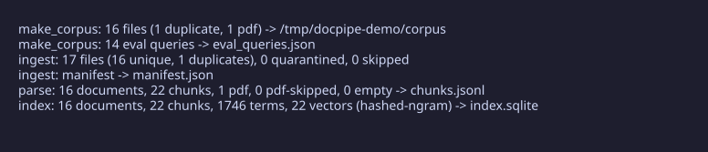
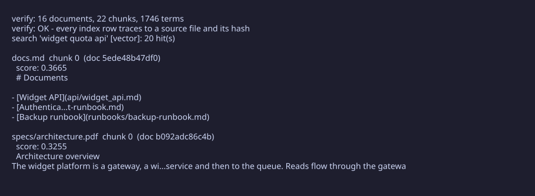

# docpipe

docpipe walks a directory of text, markdown and PDF files, hashes every file, splits them into chunks, and builds a SQLite index you can search with term, vector or hybrid queries. The part that makes it worth using is the last step: a `verify` command that checks every row in the index against a real file on disk and its content hash. If any row cannot be traced, `verify` prints the exact failure and exits non-zero. An index that reports success while silently dropping data is worse than one that refuses to build, so docpipe makes the refusal explicit.


[](https://github.com/mina-atef-00/docpipe/actions/workflows/ci.yml)





## Install

```
git clone <this repo>
cd docpipe
python -m venv .venv
source .venv/bin/activate
pip install -e ".[dev]"
```

Requires Python 3.10 or newer.

## Commands

The five you actually need:

1. `docpipe ingest corpus` - hash the corpus, dedupe repeats, quarantine
   unsafe inputs, write `manifest.json`.
2. `docpipe parse` - extract text and split into deterministic chunks,
   writing `chunks.jsonl`.
3. `docpipe index` - build `index.sqlite` with terms and vectors.
4. `docpipe verify corpus` - the gate. Recomputes every source hash and
   checks referential integrity. Exit 0 only when every index row traces to
   a source file and its hash. Exemptions for legitimately absent files are
   possible with `--exemptions`, and they print loudly when used.
5. `docpipe query search "<text>"` - the default mode is lexical BM25. Add
   `--mode vector` or `--mode hybrid` for embedding-based retrieval.

The default embedding backend is a deterministic local vectoriser, so the
whole pipeline runs with no network and no API key, and the same input gives
you the same index on any machine. There is also an OpenAI-compatible HTTP
backend, selected explicitly, and it never silently falls back to the local
one. A small read-only HTTP service is available too: `docpipe api --index
index.sqlite` exposes `/health`, `/search`, `/documents` and `/stats`.

For a longer look: `docpipe eval` runs a labelled query set and reports
recall@k, precision at k and MRR, and `docpipe query` also has `doc`,
`list`, `context` and `stats` subcommands. All query paths open the index
read-only; a query can never mutate the database.

## Grounded answers

`docpipe answer "<question>"` composes an extractive answer from the
retrieved chunks only: every sentence is quoted verbatim from a chunk and
carries a `[doc_id:chunk]` citation tracing back to that chunk in the
index. There is no generation step, so no sentence and no citation can be
invented. When no retrieved chunk overlaps the query, it refuses:

```
Refusal: cannot answer from the corpus: no retrieved chunk supports the query.
```

(exit 1). A real answer on the demo corpus:

```
$ docpipe answer "How are bearer tokens issued and validated?" --index index.sqlite --mode term --k 3
answer 'How are bearer tokens issued and validated?':
All widget endpoints require an `Authorization: Bearer *** header. [9daba2ff6d9e:0]
Tokens [9daba2ff6d9e:0]
are issued by the authentication service described in `auth_api. [9daba2ff6d9e:0]
Invalidates every future token issued to the client by rotating the signing key [7c5fd260c427:1]
Already issued tokens remain valid until expiry [7c5fd260c427:1]
The authentication service mints short-lived bearer tokens and validates them. [7c5fd260c427:0]
It is stateless: tokens carry their own signature and expiry, so no token store [7c5fd260c427:0]
POST /tokens [7c5fd260c427:0]
POST /tokens/validate [7c5fd260c427:0]
answer: grounded in 23 claim(s) across 5 chunk(s)
```

Every citation `[doc_id:chunk]` resolves to a chunk returned by the
underlying search, which the test suite asserts (citation sets are a
subset of retrieval result sets, and every marker appears in the answer
text).

## Spec and evidence

The deep technical record lives in `EVIDENCE.md`: the verification
transcript, determinism scope and limits, index schema, search ranking
details, and the construction caveats (including one corpus file whose PDF
hash is not reproducible from the seed). If you want numbers with receipts,
start there.

## Development

```
pytest -q        # tests
ruff check .     # lint
mypy             # type check
```

## License

MIT. See `LICENSE`.
